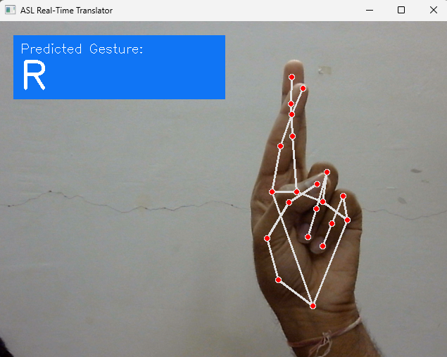
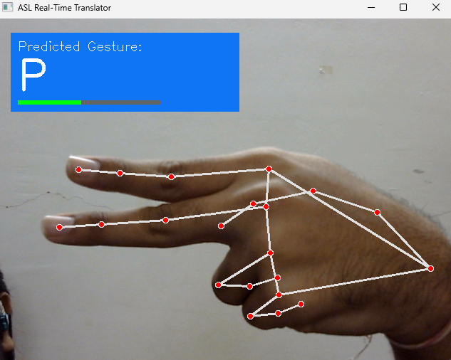
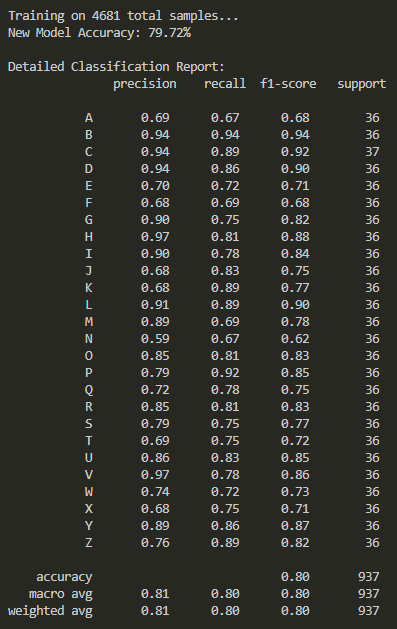

# ASL-to-Text Real-Time Hand Gesture Recognition

This repository contains a machine learning pipeline for translating American Sign Language (ASL) gestures into text in real-time. The system utilizes MediaPipe for hand landmark extraction and a Random Forest Classifier for gesture recognition, specifically optimized for high-contrast skeleton-based datasets.

---

## Core Features

* **Real-Time Inference:**
  The system translates hand gestures into results without delay by using a standard webcam feed.

* **Spatial Normalization:**
  The system establishes wrist-based coordinates through two processes which include distance-based measurement and hand size-based hand transformation.

* **Prediction Stability:**
  The system uses a temporal smoothing algorithm which combines majority voting with deque processing to decrease environmental sounds and user interface flickering.

* **Confidence Monitoring:** 
  The system presents visual feedback which shows the model's prediction probability and its classification status.

---

## Technical Architecture

* **Language:** Python 3.11
* **Computer Vision:** OpenCV, MediaPipe
* **Machine Learning:** Scikit-Learn (Random Forest)
* **Data Processing:** Pandas, NumPy
* **Visualization:** Matplotlib, Seaborn

---

## Dataset and Preprocessing

### Dataset Source

The model was trained using a skeleton-based ASL dataset, where hand joints are represented by dark lines and nodes on a white background, named as ASL Mediapipe Landmarked Dataset (A-Z) on Kaggle.

https://www.kaggle.com/datasets/granthgaurav/asl-mediapipe-converted-dataset

---

### Processing Pipeline

Standard landmark trackers often fail on non-photographic skeleton data. To address this, a custom threshold-based pipeline was implemented:

1. **Binary Segmentation**
   Grayscale thresholding is used to isolate hand geometry from the background.

2. **Radial Sorting**
   Points are sorted based on their polar angle relative to the hand centroid, ensuring a consistent feature vector (42 features per frame).

3. **Wrist-Centric Normalization**

   * Re-centers all points relative to the wrist (Landmark 0)
   * Applies scaling based on maximum hand dimension
   * Achieves position and scale invariance

---

## Project Structure

```
ASL-to-text/
│
├── train.py        # Data extraction and training pipeline
├── main.py         # Real-time inference script
├── asl_model.p     # Serialized Random Forest model
├── .gitignore      # Excludes venv, datasets, binaries
```

---

## Installation and Deployment

### 1. Clone the Repository

```bash
git clone https://github.com/Winter262005/ASL-to-text.git
cd ASL-to-text
```

### 2. Set Up Virtual Environment

```bash
python -m venv venv_311
.\venv_311\Scripts\activate
```

### 3. Install Dependencies

```bash
pip install opencv-python mediapipe scikit-learn pandas matplotlib seaborn
```

### 4. Run the Application

```bash
python main.py
```

---

## Output

Below are sample outputs from the real-time ASL translation system:

<p align="center">
  
  
</p>

Additional results:

<p align="center">
  
</p>

---

## Performance Metrics

By implementing custom spatial normalization and point sorting:

Accuracy improved from ~4% to 79.72% on the skeleton-based test dataset.

---

## Disclaimer

This project was developed for educational purposes as part of VITyarthi Course Evaluation Project.
